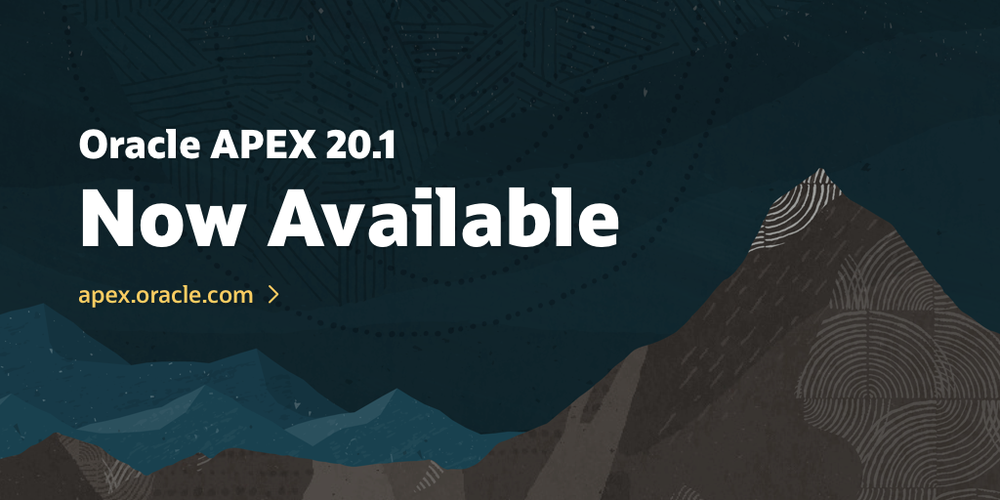

# oracle-apex-ords



## Download software from otn.oracle.com (you need a login account)

- https://www.oracle.com/database/technologies/appdev/apex.html

### Download list

- Oracle Database Express Edition 18c (XE)
- Oracle Application Express (APEX)
- Oracle REST Data Services (ORDS)

## Create download area

```bash
mkdir downloads
```

## Download area can look like this

```bash
tree downloads
downloads
├── apex_20.1.zip
└── ords-19.4.0.352.1226.zip
```

## Set environment

```bash
DATABASE_VERSION=18.4.0
APEX_VERSION=20.1
ORDS_VERSION=19.4.0.352.1226
ORDS_PORT=8888
```

## Unpack software

```bash
# create folders for the three components (ORACLE DATABASE, APEX, ORDS)
mkdir apex oradata ords
# oracle user inside container needs to have access to this folder
chmod 777 oradata
```

## unpack APEX in the background (it takes a while)

```bash
mkdir ./apex/${APEX_VERSION} || true
unzip -qq ./downloads/apex_${APEX_VERSION}.zip -d ./apex/${APEX_VERSION} &
```

### Oracle Database. Let's build on Gerald Venzl work...
```bash
git clone https://github.com/oracle/docker-images.git
```
### Copy in binary
```bash
cp ./downloads/oracle-database-xe-18c-1.0-1.x86_64.rpm \
   ./docker-images/OracleDatabase/SingleInstance/dockerfiles/${DATABASE_VERSION}
pushd ./docker-images/OracleDatabase/SingleInstance/dockerfiles/
```
### Build the image. This is going to take a while... (10 minutes)
```bash
./buildDockerImage.sh -v ${DATABASE_VERSION} -x
popd
```

## Build ords app

We will build on the work by @martindsouza

```bash
git clone https://github.com/martindsouza/docker-ords.git
pushd docker-ords
cp ./../downloads/ords-${ORDS_VERSION}.zip ./files
```

We can now build the ords image based on the ORDS binary we downloaded 

```bash
docker build -t oracle-ords:$ORDS_VERSION .
popd
```

### Do we have our images ready?
```bash
docker image ls | grep -E 'oracle\/database|oraclelinux|ords'
oracle-ords                                     19.4.0.352.1226     b4ec3b8ae107        6 days ago          221MB
oracle/database                                 18.4.0-xe           b9837e771ffe        8 weeks ago         8.38GB
oraclelinux                                     7-slim              07991a9e97a0        3 months ago        118MB
```

## Oracle Database

### Create database. It will take a while...
```bash
docker-compose up database
# Ctrl+C to stop the database after "DATABASE IS READY TO USE"
```
### Now start the database in detached mode
```bash
docker-compose up -d database
```
### Make sure health is fine. if not, perform a restart: "docker-compose restart database"
```bash
docker-compose ps
```

### Test login to the CDB from your host client
```bash
sqlplus system/oracle@localhost:1521/XE
```
### Test login to the PDB from your host client
```bash
sqlplus system/oracle@localhost:1521/XEPDB1
```

## Install APEX in the pluggable database 'XEPDB1'

```bash
pushd ./apex/${APEX_VERSION}/apex
sqlplus "sys/oracle@localhost:1521/XEPDB1 as sysdba" @./../../../install_apex.sql
popd
```

## Configure ORDS

### Create the configuration folder for given ORDS version
```bash
mkdir -p ./ords/ords-${ORDS_VERSION}/config
```

### Start the application
```bash
docker-compose up -d app
```

## VIOLA! Point your browser to: http://localhost:8888/ords
## Workspace: INTERNAL, Username: ADMIN, Password: Welcome1

```bash
open http://localhost:8888/ords
```

## Cleanup

```bash
docker-compose down -v
rm -rf ./oradata/*
rm -rf ./ords/ords-${ORDS_VERSION}
```

## Troubleshoot

### APEX version
http://localhost:8888/i/apex_version.txt

### Is the SQL Developer endpoint available?

http://localhost:8888/ords/sql-developer

